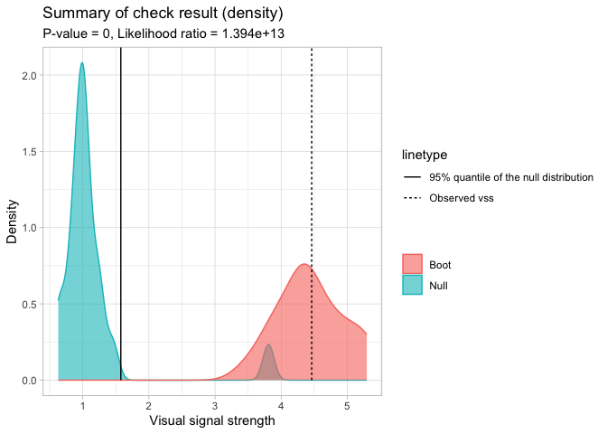

<!-- README.md is generated from README.Rmd. Please edit that file -->

# autovi

<!-- badges: start -->
<!-- badges: end -->

Buja et al. (2009) provides an inferential framework to assess whether
residual plots indeed contain visual patterns inconsistent with the
model assumptions. However, unlike conventional statistical tests that
can be performed computationally in statistical software, the lineup
protocol requires human evaluation of images. This characteristic makes
it less suitable for large-scale applications, given the associated high
labour costs and time requirements.

The `autovi` package aims to offer tools for automated visual inference
of residual plots. Currently, it only supports diagnostic checks for
classical normal linear regression models (CNLRM), as the underlying
computer vision models are specifically trained for this model class.
However, the `autovi` API is designed to be extensible to other model
types. This means you can obtain predictions as long as you provide an
appropriate method for generating null residuals through the
`null_method` argument.

## Installation

Install the released version from CRAN with

``` r
install.packages("autovi")
```

Install the development version from GitHub with:

``` r
# install.packages("remotes")
remotes::install_github("TengMCing/autovi")
```

## Trained Keras Models

``` r
library(tidyverse)
library(autovi)
```

All the available trained Keras models are listed in
`list_keras_model()`. All the trained Keras models listed below will
predict a visual signal strength for the visual patterns of the input
residual plot. This visual signal strength is essentially an
approximation of a Kullback–Leibler divergence based distance metric
which quantifies the difference between the actual residual distribution
and the reference residual distribution assumed under correct model
specification. Details about the methodologies are provided in our draft
paper
<https://github.com/TengMCing/auto_residual_reading/blob/master/paper/paper.pdf>.

``` r
list_keras_model() %>% pull(model_name)
#> [1] "vss_32"      "vss_64"      "vss_128"     "vss_phn_32"  "vss_phn_64" 
#> [6] "vss_phn_128"
```

Different Keras models are trained with residual plots obtained from
different linear regression models violating various model assumptions.

`vss_32`, `vss_64` and `vss_128` are trained with residual plots
containing visual patterns indicating non-linearity and
heteroskedasticity issues. The number in the model name represents the
size of the input image. For instance, `32` means the input image has
$32 \times 32$ pixels.

`vss_phn_32`, `vss_phn_64` and `vss_phn_128` are also trained with
residual plots containing visual patterns indicating non-linearity and
heteroskedasticity, but the visual patterns are more complex.
Additionally, residual plots with visual patterns of non-normality are
also used for these models.

## Examples

For this example, we will be using the `vss_phn_32` Keras model. The
model can be obtained by using `get_keras_model()`.

``` r
keras_model <- get_keras_model("vss_phn_32")
```

To illustrate the use of this package, we will define an incorrectly
specified model omitting certain higher-order terms of $x$.

``` r
set.seed(2024)
x <- rnorm(300)
y <- 1 + x + x^2 + x^3 + rnorm(300, sd = 3)
this_model <- lm(y ~ x)
```

The residual plot of the fitted model shows a “S” shape indicating a
non-linearity issue.

``` r
ggplot() +
  geom_point(aes(this_model$fitted.values, this_model$residuals)) +
  xlab("Fitted values") +
  ylab("Residuals")
```


To run diagnostics for this fitted model, we can initialize the checker
using `auto_vi()` and have a look at the input residual plot using the
`plot_resid()` method.

``` r
checker <- auto_vi(fitted_model = this_model, keras_model = keras_model)
checker$plot_resid()
```


To predict the visual signal strength of this residual plot, simply use
the `vss()` method.

``` r
checker$vss()
#> ✔ Predict visual signal strength for 1 image.
#> # A tibble: 1 × 1
#>     vss
#>   <dbl>
#> 1  4.46
```

Having the visual signal strength of the residual plot is usually
insufficient to determine if the model is correctly specified. Thus, we
need to evaluate some null residual plots for comparison.

The checker includes a default method to generate null residuals
consistent with the null hypothesis that the fitted model is correctly
specified, which is the `rotate_resid()` method implementing the
residual rotation technique. This method is only suitable for CLNRM.

``` r
checker$rotate_resid() %>%
  checker$plot_resid()
```


To get predictions for null residual plots, one can use the `null_vss()`
method. The `keep_null_data` and `keep_null_plot` tells the method
whether to preserve the null residuals and null residuals plots in the
result. For models that needs to use a null generating method other than
`rotate_resid()`, the function can be provided via the `null_method`
argument. The only parameter of the provided function should be
`fitted_model`, which is the fitted model object. And it should return a
data frame with two columns `.fitted` and `.resid` which are fitted
values and null residuals respectively.

``` r
checker$null_vss(20L, 
                 keep_null_data = FALSE, 
                 keep_null_plot = FALSE)
#> ✔ Generate null data.
#> ✔ Generate null plots.
#> ✔ Compute auxilary inputs.
#> ✔ Predict visual signal strength for 20 images.
#> # A tibble: 20 × 1
#>      vss
#>    <dbl>
#>  1 1.17 
#>  2 1.09 
#>  3 1.17 
#>  4 0.773
#>  5 1.24 
#>  6 0.640
#>  7 0.873
#>  8 1.06 
#>  9 1.00 
#> 10 1.01 
#> 11 3.03 
#> 12 1.15 
#> 13 1.08 
#> 14 0.910
#> 15 1.10 
#> 16 0.913
#> 17 0.848
#> 18 1.08 
#> 19 0.911
#> 20 0.665
```

If we want to measure the variation of the visual signal strength of the
residual plot, we can use the `boot_vss()` method to get bootstrapped
visual signal strength. This method resamples the observations with
replacement and refitt the regression model. Similarly, `keep_boot_data`
and `keep_boot_plot` tells the method whether to preserve bootstrapped
residuals and plots.

``` r
checker$boot_vss(20L, 
                 keep_boot_data = FALSE, 
                 keep_boot_plot = FALSE)
#> ✔ Generate bootstrapped data.
#> ✔ Generate bootstrapped plots.
#> ✔ Compute auxilary inputs.
#> ✔ Predict visual signal strength for 20 images.
#> # A tibble: 20 × 1
#>      vss
#>    <dbl>
#>  1  4.20
#>  2  4.68
#>  3  5.56
#>  4  4.15
#>  5  4.37
#>  6  5.28
#>  7  4.36
#>  8  4.12
#>  9  4.70
#> 10  4.03
#> 11  4.11
#> 12  4.16
#> 13  5.09
#> 14  4.54
#> 15  3.83
#> 16  4.31
#> 17  4.72
#> 18  5.33
#> 19  4.85
#> 20  4.08
```

To run a comprehensive check including the analysis of null residuals
and bootstrapped residuals, use the `check()` method.

``` r
checker$check(null_draws = 20L, boot_draws = 20L)
#> ✔ Generate null data.
#> ✔ Generate null plots.
#> ✔ Compute auxilary inputs.
#> ✔ Predict visual signal strength for 20 images.
#> ✔ Generate bootstrapped data.
#> ✔ Generate bootstrapped plots.
#> ✔ Compute auxilary inputs.
#> ✔ Predict visual signal strength for 20 images.
#> ✔ Predict visual signal strength for 1 image.
```

The check result is stored in the `check_result` attribute. If you print
the `checker` object, it will show a brief summary of the result.

``` r
checker
#> 
#> ── <AUTO_VI object>
#> Status:
#>  - Fitted model: lm
#>  - Keras model: (None, 32, 32, 3) + (None, 5) -> (None, 1)
#>     - Output node index: 1
#>  - Result:
#>     - Observed visual signal strength: 4.461 (p-value = 0)
#>     - Null visual signal strength: [20 draws]
#>        - Mean: 1.14
#>        - Quantiles: 
#>           ╔═════════════════════════════════════════════════╗
#>           ║   25%    50%    75%    80%    90%    95%    99% ║
#>           ║0.8896 1.0072 1.1204 1.2076 1.3012 1.5755 3.3615 ║
#>           ╚═════════════════════════════════════════════════╝
#>     - Bootstrapped visual signal strength: [20 draws]
#>        - Mean: 4.445 (p-value = 0)
#>        - Quantiles: 
#>           ╔══════════════════════════════════════════╗
#>           ║  25%   50%   75%   80%   90%   95%   99% ║
#>           ║4.162 4.395 4.789 4.905 5.185 5.292 5.293 ║
#>           ╚══════════════════════════════════════════╝
#>     - Likelihood ratio: 0.7295 (boot) / 5.232e-14 (null) = 1.394e+13
```

A summary plot can be drawn with the `summary_plot()` method. The solid
line is the 95% sample quantile of the visual signal strength predicted
for null residual plots. The dot line is the visual signal strength
predicted for the original residual plot. The blue density curve
indicates the distribution of visual signal strength predicted for null
residual plots. And the red density curve indicates the distribution of
visual signal strength predicted for bootstrapped residual plots.

The $p$-value is obtained by computing the ratio of null visual signal
strength greater than or equal to observed visual signal strength. The
red area along with the solid line indicates how often the fitted model
would be considered incorrectly specified if the data can be
repetitively drawn from the same data generating process.

For this example, the $H_0$ is rejected because of small $p$-value. It
can also be observed that almost all the time the refitted models will
be considered as incorrectly specified, so this is a clear rejection.
Furthermore, since two density curves are very different from each
other, it is very unlikely the original residuals are from the same
distribution of null residuals.

``` r
checker$summary_plot()
```



### Feature extraction

This package also enables the extraction of features from keras model
for other purposes. To extract features from a specific layer of the
keras model, one needs to provide the argument
`extract_feature_from_layer`. The following code chunk extract features
from the global pooling layer of the keras model.

``` r
checker$vss(extract_feature_from_layer = "global_max_pooling2d") %>%
  names()
#> ✔ Predict visual signal strength for 1 image.
#>   [1] "vss"   "f_1"   "f_2"   "f_3"   "f_4"   "f_5"   "f_6"   "f_7"   "f_8"  
#>  [10] "f_9"   "f_10"  "f_11"  "f_12"  "f_13"  "f_14"  "f_15"  "f_16"  "f_17" 
#>  [19] "f_18"  "f_19"  "f_20"  "f_21"  "f_22"  "f_23"  "f_24"  "f_25"  "f_26" 
#>  [28] "f_27"  "f_28"  "f_29"  "f_30"  "f_31"  "f_32"  "f_33"  "f_34"  "f_35" 
#>  [37] "f_36"  "f_37"  "f_38"  "f_39"  "f_40"  "f_41"  "f_42"  "f_43"  "f_44" 
#>  [46] "f_45"  "f_46"  "f_47"  "f_48"  "f_49"  "f_50"  "f_51"  "f_52"  "f_53" 
#>  [55] "f_54"  "f_55"  "f_56"  "f_57"  "f_58"  "f_59"  "f_60"  "f_61"  "f_62" 
#>  [64] "f_63"  "f_64"  "f_65"  "f_66"  "f_67"  "f_68"  "f_69"  "f_70"  "f_71" 
#>  [73] "f_72"  "f_73"  "f_74"  "f_75"  "f_76"  "f_77"  "f_78"  "f_79"  "f_80" 
#>  [82] "f_81"  "f_82"  "f_83"  "f_84"  "f_85"  "f_86"  "f_87"  "f_88"  "f_89" 
#>  [91] "f_90"  "f_91"  "f_92"  "f_93"  "f_94"  "f_95"  "f_96"  "f_97"  "f_98" 
#> [100] "f_99"  "f_100" "f_101" "f_102" "f_103" "f_104" "f_105" "f_106" "f_107"
#> [109] "f_108" "f_109" "f_110" "f_111" "f_112" "f_113" "f_114" "f_115" "f_116"
#> [118] "f_117" "f_118" "f_119" "f_120" "f_121" "f_122" "f_123" "f_124" "f_125"
#> [127] "f_126" "f_127" "f_128" "f_129" "f_130" "f_131" "f_132" "f_133" "f_134"
#> [136] "f_135" "f_136" "f_137" "f_138" "f_139" "f_140" "f_141" "f_142" "f_143"
#> [145] "f_144" "f_145" "f_146" "f_147" "f_148" "f_149" "f_150" "f_151" "f_152"
#> [154] "f_153" "f_154" "f_155" "f_156" "f_157" "f_158" "f_159" "f_160" "f_161"
#> [163] "f_162" "f_163" "f_164" "f_165" "f_166" "f_167" "f_168" "f_169" "f_170"
#> [172] "f_171" "f_172" "f_173" "f_174" "f_175" "f_176" "f_177" "f_178" "f_179"
#> [181] "f_180" "f_181" "f_182" "f_183" "f_184" "f_185" "f_186" "f_187" "f_188"
#> [190] "f_189" "f_190" "f_191" "f_192" "f_193" "f_194" "f_195" "f_196" "f_197"
#> [199] "f_198" "f_199" "f_200" "f_201" "f_202" "f_203" "f_204" "f_205" "f_206"
#> [208] "f_207" "f_208" "f_209" "f_210" "f_211" "f_212" "f_213" "f_214" "f_215"
#> [217] "f_216" "f_217" "f_218" "f_219" "f_220" "f_221" "f_222" "f_223" "f_224"
#> [226] "f_225" "f_226" "f_227" "f_228" "f_229" "f_230" "f_231" "f_232" "f_233"
#> [235] "f_234" "f_235" "f_236" "f_237" "f_238" "f_239" "f_240" "f_241" "f_242"
#> [244] "f_243" "f_244" "f_245" "f_246" "f_247" "f_248" "f_249" "f_250" "f_251"
#> [253] "f_252" "f_253" "f_254" "f_255" "f_256"
```

To check all the available layer names, one can list them with the
`KERAS_WRAPPER` class.

``` r
KERAS_WRAPPER$list_layer_name(keras_model)
#>  [1] "input_1"                  "tf.__operators__.getitem"
#>  [3] "tf.nn.bias_add"           "grey_scale"              
#>  [5] "block1_conv1"             "batch_normalization"     
#>  [7] "activation"               "block1_conv2"            
#>  [9] "batch_normalization_1"    "activation_1"            
#> [11] "block1_pool"              "dropout"                 
#> [13] "block2_conv1"             "batch_normalization_2"   
#> [15] "activation_2"             "block2_conv2"            
#> [17] "batch_normalization_3"    "activation_3"            
#> [19] "block2_pool"              "dropout_1"               
#> [21] "block3_conv1"             "batch_normalization_4"   
#> [23] "activation_4"             "block3_conv2"            
#> [25] "batch_normalization_5"    "activation_5"            
#> [27] "block3_conv3"             "batch_normalization_6"   
#> [29] "activation_6"             "block3_pool"             
#> [31] "dropout_2"                "block4_conv1"            
#> [33] "batch_normalization_7"    "activation_7"            
#> [35] "block4_conv2"             "batch_normalization_8"   
#> [37] "activation_8"             "block4_conv3"            
#> [39] "batch_normalization_9"    "activation_9"            
#> [41] "block4_pool"              "dropout_3"               
#> [43] "block5_conv1"             "batch_normalization_10"  
#> [45] "activation_10"            "block5_conv2"            
#> [47] "batch_normalization_11"   "activation_11"           
#> [49] "block5_conv3"             "batch_normalization_12"  
#> [51] "activation_12"            "block5_pool"             
#> [53] "dropout_4"                "global_max_pooling2d"    
#> [55] "additional_input"         "concatenate"             
#> [57] "dense"                    "dropout_5"               
#> [59] "activation_13"            "dense_1"
```

While running the comprehensive check with the `check()` method, one can
provide the `extract_feature_from_layer` argument to extract features.

``` r
checker$check(null_draws = 20L, boot_draws = 20L, extract_feature_from_layer = "global_max_pooling2d")
#> ✔ Generate null data.
#> ✔ Generate null plots.
#> ✔ Compute auxilary inputs.
#> ✔ Predict visual signal strength for 20 images.
#> ✔ Generate bootstrapped data.
#> ✔ Generate bootstrapped plots.
#> ✔ Compute auxilary inputs.
#> ✔ Predict visual signal strength for 20 images.
#> ✔ Predict visual signal strength for 1 image.
```

The features are also stored in the `check_result` attribute.

``` r
checker$check_result$observed
#> # A tibble: 1 × 257
#>     vss   f_1    f_2   f_3   f_4   f_5     f_6    f_7   f_8    f_9  f_10  f_11
#>   <dbl> <dbl>  <dbl> <dbl> <dbl> <dbl>   <dbl>  <dbl> <dbl>  <dbl> <dbl> <dbl>
#> 1  4.46 0.167 0.0687     0     0     0 0.00164 0.0695     0 0.0847     0     0
#> # ℹ 245 more variables: f_12 <dbl>, f_13 <dbl>, f_14 <dbl>, f_15 <dbl>,
#> #   f_16 <dbl>, f_17 <dbl>, f_18 <dbl>, f_19 <dbl>, f_20 <dbl>, f_21 <dbl>,
#> #   f_22 <dbl>, f_23 <dbl>, f_24 <dbl>, f_25 <dbl>, f_26 <dbl>, f_27 <dbl>,
#> #   f_28 <dbl>, f_29 <dbl>, f_30 <dbl>, f_31 <dbl>, f_32 <dbl>, f_33 <dbl>,
#> #   f_34 <dbl>, f_35 <dbl>, f_36 <dbl>, f_37 <dbl>, f_38 <dbl>, f_39 <dbl>,
#> #   f_40 <dbl>, f_41 <dbl>, f_42 <dbl>, f_43 <dbl>, f_44 <dbl>, f_45 <dbl>,
#> #   f_46 <dbl>, f_47 <dbl>, f_48 <dbl>, f_49 <dbl>, f_50 <dbl>, f_51 <dbl>, …
```

This package provide ways to conduct PCA on these features. The
`feature_pca` method will combine the features obtained from the
prediction of the observed residual plot, null residual plots, and the
bootstrapped residual plots, then conduct PCA on them. The results are
the rotated features. The variable `set` provides the set label of the
observation, which can either be “observed”, “null” or “boot”.

``` r
checker$feature_pca()
#> # A tibble: 41 × 298
#>      f_1    f_2   f_3   f_4   f_5     f_6    f_7   f_8    f_9  f_10  f_11  f_12
#>    <dbl>  <dbl> <dbl> <dbl> <dbl>   <dbl>  <dbl> <dbl>  <dbl> <dbl> <dbl> <dbl>
#>  1 0.167 0.0687  0     0    0     0.00164 0.0695 0     0.0847 0     0     0.149
#>  2 1.08  4.14    4.10  5.43 2.35  2.04    3.09   2.39  2.01   1.94  4.32  2.43 
#>  3 1.10  2.85    2.90  3.08 1.20  1.21    1.69   1.50  1.59   0.828 2.55  1.75 
#>  4 0.827 3.20    2.92  3.45 1.50  1.28    1.89   1.61  1.64   1.28  2.66  1.71 
#>  5 0.955 3.85    3.74  5.17 2.24  1.97    2.96   2.25  1.81   1.91  4.04  2.23 
#>  6 1.22  3.60    3.70  4.70 2.00  1.72    2.66   2.19  1.77   1.57  3.83  2.18 
#>  7 1.21  3.41    3.51  4.22 1.75  1.58    2.37   1.99  1.75   1.33  3.47  2.08 
#>  8 1.09  3.00    3.04  3.71 1.53  1.40    2.12   1.76  1.53   1.16  3.01  1.85 
#>  9 1.02  2.87    2.84  3.42 1.42  1.28    1.94   1.65  1.45   1.09  2.75  1.70 
#> 10 0.570 1.72    1.25  1.36 0.270 0.342   0.419  0.545 0.959  0.267 0.913 0.875
#> # ℹ 31 more rows
#> # ℹ 286 more variables: f_13 <dbl>, f_14 <dbl>, f_15 <dbl>, f_16 <dbl>,
#> #   f_17 <dbl>, f_18 <dbl>, f_19 <dbl>, f_20 <dbl>, f_21 <dbl>, f_22 <dbl>,
#> #   f_23 <dbl>, f_24 <dbl>, f_25 <dbl>, f_26 <dbl>, f_27 <dbl>, f_28 <dbl>,
#> #   f_29 <dbl>, f_30 <dbl>, f_31 <dbl>, f_32 <dbl>, f_33 <dbl>, f_34 <dbl>,
#> #   f_35 <dbl>, f_36 <dbl>, f_37 <dbl>, f_38 <dbl>, f_39 <dbl>, f_40 <dbl>,
#> #   f_41 <dbl>, f_42 <dbl>, f_43 <dbl>, f_44 <dbl>, f_45 <dbl>, f_46 <dbl>, …
```
