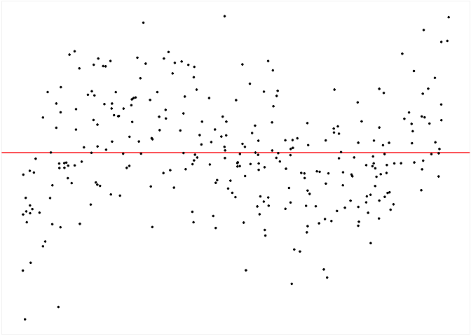

<!-- README.md is generated from README.Rmd. Please edit that file -->

# autovi

<!-- badges: start -->
<!-- badges: end -->

The goal of `autovi` is to provide tools for conducting auto visual
inference.

## Installation

You can install the development version of autovi like so:

``` r
remotes::install_github("TengMCing/autovi")
```

## Examples

``` r
library(tidyverse)
```

``` r
keras_mod <- keras::load_model_tf(here::here("temp_model/32"))
dgp_mod <- visage::poly_model(x = visage::rand_uniform(-1, 1), sigma = 1)

this_dat <- dgp_mod$gen(300)
this_mod <- dgp_mod$fit(this_dat)

my_vi <- autovi::auto_vi(fitted_mod = this_mod,
                         keras_mod = keras_mod,
                         node_index = 1L)

my_vi$check(boot_draws = 100L, null_draws = 100L)
my_vi
#> 
#> ── <AUTO_VI object>
#> Status:
#>  - Fitted model: lm
#>  - Keras model: (None, 32, 32, 3) -> (None, 1)
#>     - Output node index: 1
#>  - Result:
#>     - Observed visual signal strength: 4.398 (p-value = 0)
#>     - Null visual signal strength: [100 draws]
#>        - Mean: 0.09791
#>        - Quantiles: 
#>           ╔═════════════════════════════════════════════════╗
#>           ║   25%    50%    75%    80%    90%    95%    99% ║
#>           ║0.0000 0.0000 0.0000 0.0000 0.1729 0.6822 1.7068 ║
#>           ╚═════════════════════════════════════════════════╝
#>     - Bootstrapped visual signal strength: [100 draws]
#>        - Mean: 4.099 (p-value = 0)
#>        - Quantiles: 
#>           ╔══════════════════════════════════════════╗
#>           ║  25%   50%   75%   80%   90%   95%   99% ║
#>           ║3.951 4.123 4.249 4.284 4.412 4.452 4.594 ║
#>           ╚══════════════════════════════════════════╝
#>     - Likelihood ratio: 0.8637 (boot) / 0 (null) = Inf
```

``` r
my_vi$summary_plot()
```


